<div align="center">



# syahmiharith

**Builder, learner, and problem solver.**

[](https://github.com/syahmiharith?tab=followers)
[](https://github.com/syahmiharith)
[](mailto:zsyhmizlkfli12@gmail.com)

[About](#about) · [Tech](#tech) · [Projects](#projects) · [GitHub](#github-activity) · [Connect](#connect)

</div>

---

## About

```txt
Currently: sharpening my engineering skills
Focus: practical software, clean UX, and useful automation
Working style: learn fast, build carefully, ship iteratively
```

<details open>
<summary><b>Open my command palette</b></summary>

| Command | Result |
| --- | --- |
| `whoami` | A developer building toward stronger full-stack and automation work. |
| `now` | Learning, experimenting, and improving my GitHub portfolio. |
| `values` | Clear thinking, useful tools, and steady progress. |
| `collab` | Open to projects, learning opportunities, and practical ideas. |

</details>

<details>
<summary><b>What I am building toward</b></summary>

- Stronger real-world projects with clean READMEs and demos.
- Better habits around testing, documentation, and maintainable code.
- A portfolio that shows how I think, not just what tools I use.

</details>

## Tech

<div align="center">


</div>

<details>
<summary><b>Click to filter by interest</b></summary>

| Area | Tools and topics |
| --- | --- |
| Frontend | HTML, CSS, JavaScript, TypeScript, React |
| Backend | Node.js, APIs, data handling |
| Workflow | Git, GitHub, documentation, automation |
| Learning next | Testing, deployment, stronger project architecture |

</details>

## Projects

<details open>
<summary><b>Featured project slots</b></summary>

| Project | What it should show | Status |
| --- | --- | --- |
| `project-one` | A polished app with a clear problem, demo, and screenshots. | Add soon |
| `project-two` | A practical automation or developer tool. | Add soon |
| `project-three` | A learning project with strong notes and clean code. | Add soon |

</details>

> Tip for future updates: replace these rows with pinned repositories once you have the projects you want visitors to see first.

## GitHub Activity

<div align="center">


</div>

<details>
<summary><b>How to read this profile</b></summary>

- The cards above update from public GitHub data.
- Collapsible sections keep the page scan-friendly.
- Project slots are intentionally easy to replace as your portfolio grows.

</details>

## Connect

<div align="center">

[](https://github.com/syahmiharith)
[](mailto:zsyhmizlkfli12@gmail.com)

</div>

---

<div align="center">

<sub>Built as an interactive GitHub profile README using GitHub-flavored Markdown.</sub>

</div>
