<h1 align="center">Zulsyahmi Zulkefli</h1>

  

  Computer Science Student @ Sungkyunkwan University · Backend / Full-stack Engineer
   
  TypeScript · NestJS · PostgreSQL · Redis · Docker · GCP · AI tooling

  

  <a href="https://www.linkedin.com/in/zulsyahmi-zulkefli-4087b2234">LinkedIn</a> ·
  <a href="mailto:zsyhmizlkfli12@gmail.com">Email</a> ·
  <a href="https://github.com/syahmiharith">GitHub</a> ·
  <a href="https://github.com/santifer/career-ops/pulls?q=author%3Asyahmiharith">OSS Contributions</a>

  <a href="#featured-work">Featured Work</a> ·
  <a href="#saas-starter-api">SaaS API</a> ·
  <a href="#open-source">Open Source</a> ·
  <a href="#technical-focus">Technical Focus</a> ·
  <a href="#github-activity">Stats</a>

---

## Featured Work

| Project | What it proves | Stack |
| --- | --- | --- |
| [SaaS Starter API](https://github.com/syahmiharith/saas-starter-api) | Production-style backend: auth, RBAC, billing, API keys, quotas, audit logs, tests, GCP staging | NestJS, TypeScript, PostgreSQL, Prisma, Redis/BullMQ, Stripe, Docker, Terraform, GCP |
| [Career-Ops OSS Contributions](https://github.com/santifer/career-ops/pulls?q=author%3Asyahmiharith) | Open-source collaboration on AI-powered job-search tooling with 39k+ stars | Go, JavaScript, Claude Code, CI, docs |
| [ShuGo](https://github.com/syahmiharith/ShuGo-) | Mobile productivity platform with Firebase backend and project documentation | Expo, React Native, TypeScript, Firebase, Python |
| [MNM Apparel](https://github.com/syahmiharith/mnmapparel) | Business landing page with modular frontend/backend structure | Next.js, React, TypeScript, FastAPI, Docker |

<b>Interactive project console</b>

| Command | Opens |
| --- | --- |
| `demo saas-api` | [Cloud Run health check](https://saas-starter-api-staging-6xiqyp324q-uc.a.run.app/api/v1/health) |
| `docs saas-api` | [Swagger/OpenAPI](https://saas-starter-api-staging-6xiqyp324q-uc.a.run.app/docs) |
| `walkthrough saas-api` | [API walkthrough](https://github.com/syahmiharith/saas-starter-api/blob/main/docs/api-walkthrough.md) |
| `oss career-ops` | [PRs authored by syahmiharith](https://github.com/santifer/career-ops/pulls?q=author%3Asyahmiharith) |

## SaaS Starter API

Production-style multi-tenant SaaS backend with auth, RBAC, API keys, usage quotas, Stripe billing, audit logs, admin APIs, Swagger docs, Docker, Terraform, and GCP staging.

<b>Proof links</b>

- [Live health check](https://saas-starter-api-staging-6xiqyp324q-uc.a.run.app/api/v1/health)
- [Swagger/OpenAPI docs](https://saas-starter-api-staging-6xiqyp324q-uc.a.run.app/docs)
- [Postman collection](https://github.com/syahmiharith/saas-starter-api/tree/main/collections/postman)
- [Architecture docs](https://github.com/syahmiharith/saas-starter-api/blob/main/docs/architecture.md)
- [API walkthrough](https://github.com/syahmiharith/saas-starter-api/blob/main/docs/api-walkthrough.md)
- Unit, integration, e2e, and staging smoke test instructions

<b>System capabilities</b>

| Area | Implementation signal |
| --- | --- |
| Authentication | Email/password auth, JWT access tokens, refresh token rotation |
| Tenancy | Organization-scoped billing, usage, API keys, members, audit logs |
| Authorization | Owner/admin/member/viewer RBAC |
| Billing | Stripe checkout, billing portal, webhook idempotency |
| Infrastructure | Docker, GitHub Actions, Terraform, Cloud Run, Cloud SQL, Redis |
| Quality | Unit, integration, e2e, and staging smoke test paths |

## Open Source

- Contributed to [santifer/career-ops](https://github.com/santifer/career-ops), an AI-powered job-search system with 39k+ stars.
- Merged PR: [Add Codex support to Career-Ops](https://github.com/santifer/career-ops/pull/41).
- Open PR: [feat: add structured machine summaries to evaluations](https://github.com/santifer/career-ops/pull/444).

<b>Contribution details</b>

| PR | Status | Signal |
| --- | --- | --- |
| [Add Codex support to Career-Ops](https://github.com/santifer/career-ops/pull/41) | Merged | Added support for another AI coding workflow in an existing open-source system |
| [feat: add structured machine summaries to evaluations](https://github.com/santifer/career-ops/pull/444) | Open | Adds structured machine-readable summaries for evaluation workflows |

## Technical Focus

**Backend:** TypeScript, NestJS, Node.js, REST APIs, RBAC, JWT, webhooks  
**Data:** PostgreSQL, Prisma, Redis/BullMQ  
**Cloud/DevOps:** Docker, GitHub Actions, Terraform, GCP Cloud Run, Cloud SQL, Secret Manager  
**Frontend:** React, Next.js, Tailwind CSS  
**AI tooling:** Agent workflows, evaluation pipelines, LLM-assisted automation

<b>Toolbox badges</b>

  
  
  
  
  
  
  
  

## GitHub Activity

  

  

## Currently Building

- Production-style backend systems with clear APIs, tests, docs, and deployment paths.
- Open-source contributions to AI-assisted engineering workflows.
- Portfolio projects that prioritize maintainability, proof links, and recruiter-readable documentation.
